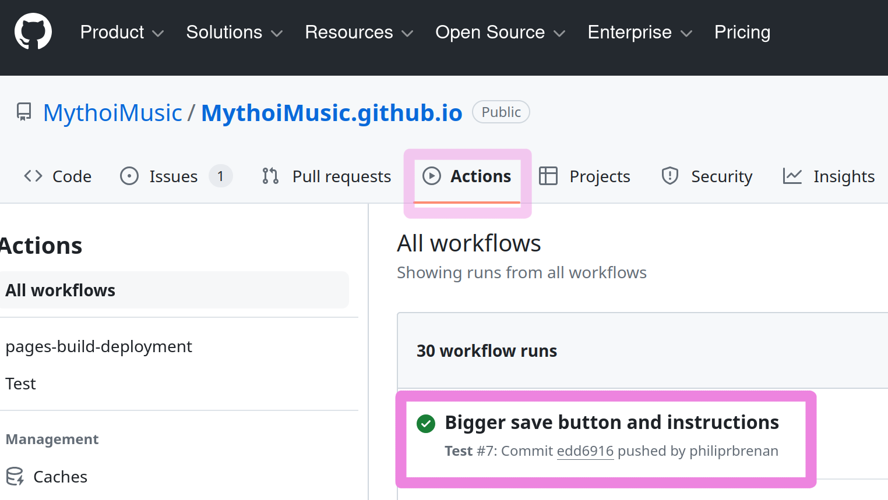

# MythoiMusic.github.io

## Frequently Asked Questions

### How can I download my catalog?

Select the actions tab to see the actions that produce your catalog:

Select the latest action displayed by clicking on its name:

Scroll to the bottom, where you will see the word **Catalog**.  Click on the
word **Catalog** to down load a zip file that contains your catalog as a
spreadsheet.  Once downloaded an unzipped this file can be processed by Libre
Office or Excel.
